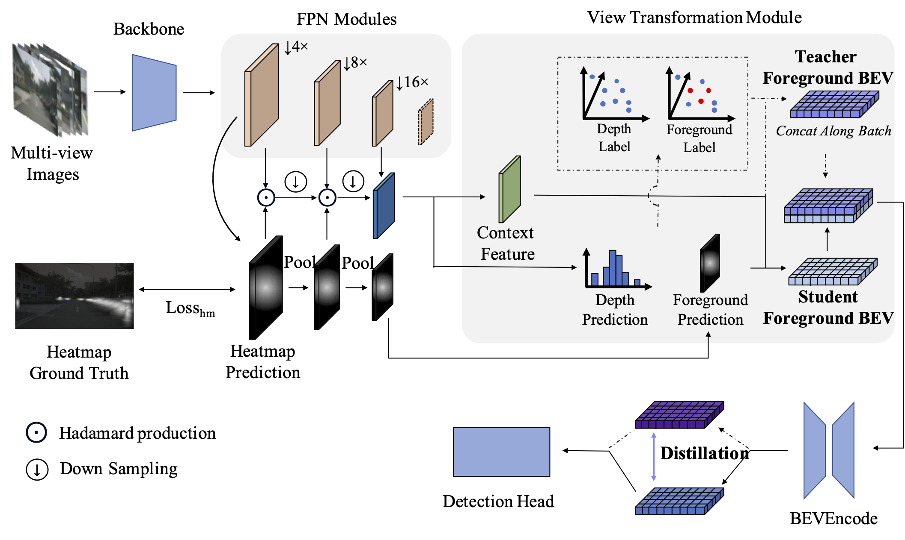

<div align="center">
<h1>FSD-BEV</h1>
<h3>[ECCV2024] FSD-BEV: Foreground Self-Distillation for Multi-view 3D Object Detection</h3>
</div>


<div align="center">
  
</div><br/>

## News

- **2024.07.4** FSD-BEV is accepted by ECCV 2024. The paper is available [here](https://arxiv.org/abs/2407.10135).

## Main Results

| Config                                                          | mAP   | NDS  | Baidu | Google |
| --------------------------------------------------------------- | :----: | :----: | :-----: | :---: |
| [**FSD-BEV-R50-CBGS**](configs/fsdbev/fsdbev-r50-cbgs.py)                    | 40.3  | 52.6 | [link](https://pan.baidu.com/s/1T0-h9lxi5NUnVknaxypvjA?pwd=wqjn) | [link](https://drive.google.com/drive/folders/1VmhYu4ppfi-NYbwT-5EplqUTXUvmL19-?usp=sharing) |
| [**FSD-BEV-R101-CBGS**](configs/fsdbev/fsdbev-r101-cbgs.py)          | 48.8  | 58.9 | [link](https://pan.baidu.com/s/1T0-h9lxi5NUnVknaxypvjA?pwd=wqjn) | [link](https://drive.google.com/drive/folders/1VmhYu4ppfi-NYbwT-5EplqUTXUvmL19-?usp=sharing) |


## Get Started

#### 1. Please follow these steps to install FSD-BEV.

a. Create a conda virtual environment and activate it.
```shell
conda create -n fsdbev python=3.8 -y
conda activate fsdbev
```

b. Install PyTorch and torchvision following the [official instructions](https://pytorch.org/).
```shell
pip install torch==1.10.0+cu111 torchvision==0.11.0+cu111 torchaudio==0.10.0 -f https://download.pytorch.org/whl/torch_stable.html
```

c. Install FSD-BEV as mmdet3d.
```shell
pip install mmcv-full==1.5.3
pip install mmdet==2.25.1
pip install mmsegmentation==0.25.0
pip install -e .
```

#### 2. Prepare nuScenes dataset as introduced in [nuscenes_det.md](docs/en/datasets/nuscenes_det.md) and create the pkl for FSD-BEV by running:

```shell
python tools/create_data_bevdet.py
```

#### 3. Download nuScenes-lidarseg from nuScenes official site and put it under data/nuscenes/. Create data after Frame Combination processing by running:
```shell
python tools/generate_depth_multi.py
```

#### 4. Train and evalutate model following:
```shell
bash tools/dist_train.sh configs/fsdbev/fsdbev-r50-cbgs.py 8
bash tools/dist_test.sh configs/fsdbev/fsdbev-r50-cbgs.py $CHECKPOINT 8 --eval bbox
```


## Acknowledgement

This project is not possible without multiple great open-sourced code bases. We list some notable examples below.

- [BEVDet](https://github.com/HuangJunJie2017/BEVDet)
- [BEVDepth](https://github.com/Megvii-BaseDetection/BEVDepth)
- [SA-BEV](https://github.com/mengtan00/SA-BEV)
- [open-mmlab](https://github.com/open-mmlab)
- [CenterPoint](https://github.com/tianweiy/CenterPoint)
- [Lift-Splat-Shoot](https://github.com/nv-tlabs/lift-splat-shoot)


## Bibtex

If FSD-BEV is helpful for your research, please consider citing the following BibTeX entry.
```
@inproceedings{jiang2025fsd,
  title={FSD-BEV: Foreground Self-Distillation for Multi-view 3D Object Detection},
  author={Jiang, Zheng and Zhang, Jinqing and Zhang, Yanan and Liu, Qingjie and Hu, Zhenghui and Wang, Baohui and Wang, Yunhong},
  booktitle={European Conference on Computer Vision},
  pages={110--126},
  year={2025},
  organization={Springer}
}
```

